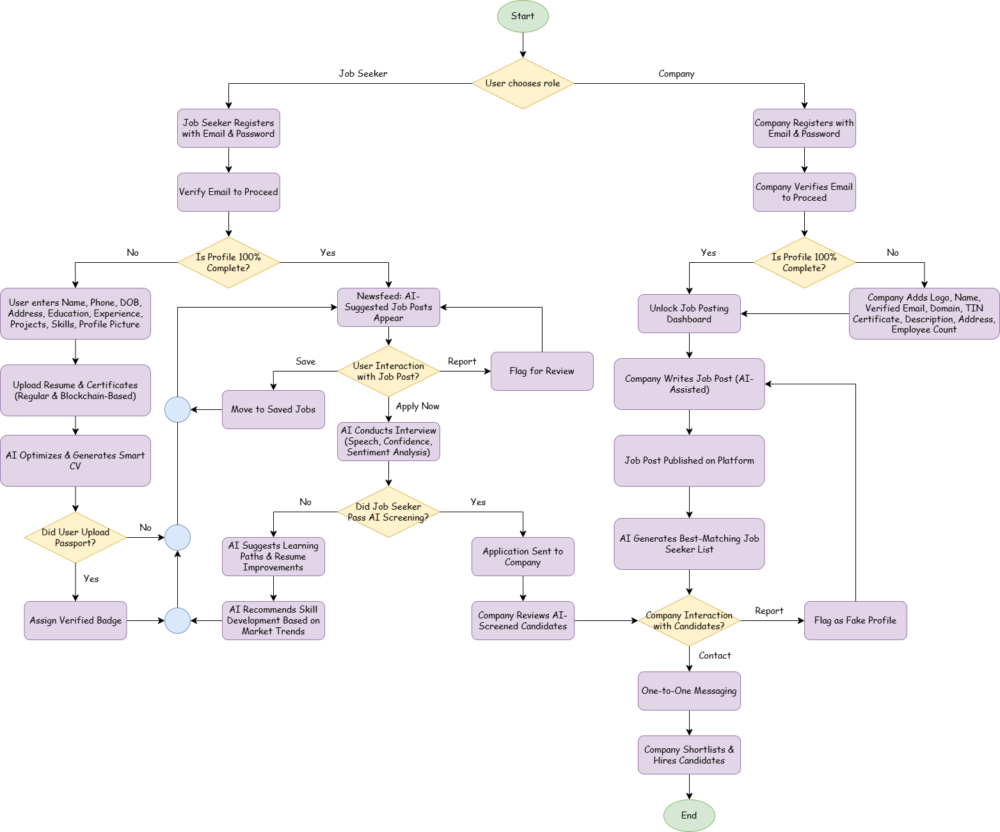
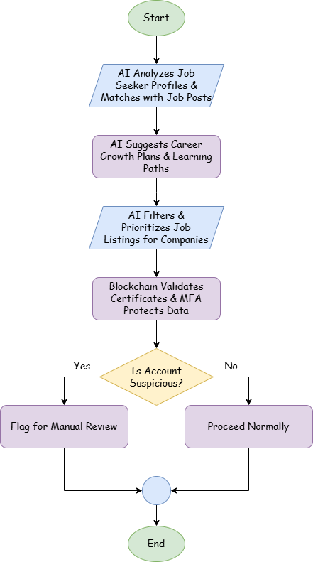
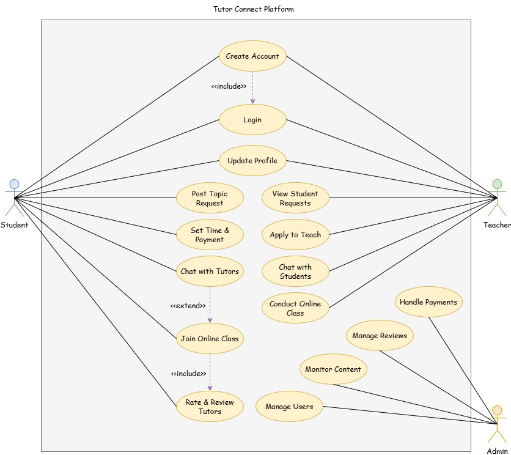

<h1 align="center">Team Prefetch</h1>

<table>
  <tr align="center">
    <th>Md. Waliul Islam Rayhan</th>
    <th>Md. Nahid Hasan</th>
    <th>Asir Shahriar Roudra</th>
    <th>Nishat Mahmud</th>
  </tr>
  <tr align="center">
    <td>Team Leader</td>
    <td>Team Member</td>
    <td>Team Member</td>
    <td>Team Member</td>
  </tr>
  <tr align="center">
    <td>Frontend Developer</td>
    <td>Backend Developer</td>
    <td>AI/ML Engineer</td>
    <td>UI/UX Designer</td>
  </tr>
  <tr align="center">
    <td><a href="https://github.com/waliulrayhan">@waliulrayhan</a></td>
    <td><a href="https://github.com/nahid515023">@nahid515023</a></td>
    <td><a href="https://github.com/roudra323">@roudra323</a></td>
    <td><a href="https://github.com/nishatrhythm">@nishatrhythm</a></td>
  </tr>
</table>

---

## Table of Contents

1. [CareerLink - AI-Powered Job Recruitment & Networking](#careerlink--connecting-talent-empowering-futures)
2. [Tutor Connect](#tutor-connect)

---

<strong>ABSTRACT OF THE PROJECT - 1</strong>

<h2 align="center">CareerLink – Connecting Talent, Empowering Futures</h2>

An AI-Powered Job Recruitment & Professional Networking Platform

 

### Problem Statement

Traditional recruitment processes are riddled with inefficiencies, biases, and one-size-fits-all approaches that fail both job seekers and companies. Job seekers often struggle to get noticed due to generic profiles and receive irrelevant job recommendations, while companies face an overwhelming volume of applications and difficulty in filtering the best-fit candidates. This platform seeks to address these issues by introducing a dual-sided system where both job seekers and companies undergo rigorous profile validation, allowing for AI-driven smart matching, personalized career development, and secure verification methods.

### Proposed Solution

Our platform emulates a LinkedIn-style ecosystem with two distinct user types:

**1. Job Seekers**

- **Registration & Profile Completion:**
    
Users register using an email and password. They are required to complete their profile before accessing any content. The profile collects detailed personal information, including Name, Phone, Date of Birth, Address, Educational Qualifications, Previous Experience, Projects, Skills, Profile Picture, and more.

- **Document Uploads & Smart CV Generation:**
    
Job seekers can upload certifications and resumes. The platform then leverages AI/ML to generate a smart, optimized CV tailored to industry standards.

- **Blockchain & Verification Features:**
    
Users with blockchain-secured certificates can add these to their profiles. Additionally, passport verification earns them a verified badge for enhanced trust.

**2. Companies**

- **Registration & Profile Completion:**
    
Companies must complete a detailed registration that includes uploading the company logo, providing the Company Name, a verified email, domain (if available), TIN Certificate, Company Description, Address, Employee Count, and related details before posting any jobs.

- **Job Post Creation with AI Assistance:**
    
While creating a job post, companies benefit from an AI assistant that guides them in drafting effective job descriptions.

- **Candidate Matching & Interaction:**
    
Once a job post is published, companies receive a curated list of job seekers who best match the required skills, experience, education, and project background. For each candidate, two actions are provided:

    - **Contact:** Enables one-to-one communication and further coordination for a screening test.
    - **Report:** Flags the candidate if they appear to be a fake or fraudulent profile.

### System Workflow & UI/UX

**1. User Onboarding (Job Seeker Perspective):**

- **Step 1: Registration & Profile Completion**
    
Job seekers sign up with email and password and must fill out all mandatory fields (personal information, educational background, work experience, projects, skills, profile picture, etc.) before unlocking the platform’s full features.

- **Step 2: Document & Certificate Upload**
    
Users upload various certifications and resumes. Verified blockchain certificates and passport verification lead to enhanced credibility via badges.

- **Step 3: Newsfeed & Job Post Interaction**
    
Upon profile completion, the job seeker’s homepage displays a dynamic newsfeed populated with job posts from companies. Each post includes three interactive buttons:

    - **Apply Now:** Opens a dedicated job post page where the candidate must complete a brief, AI-driven screen test via video (a mock interview assessing speech, tone, and confidence).
    - **Save:** Allows the candidate to bookmark the post for future reference.
    - **Report Post:** Enables the user to flag any suspicious or fake job postings.

Figure 1 : System Flowchart

**2. Company Onboarding & Interaction (Company Perspective):**

- **Step 1: Registration & Profile Completion**
    
Companies register and complete their profiles by providing detailed company information (logo, name, verified email, domain, TIN Certificate, description, address, employee count, etc.).

- **Step 2: Job Post Creation with AI Assistance**
    
After profile completion, companies can create job posts. An integrated AI assistant helps draft the job description by suggesting improvements and industry-relevant keywords.

- **Step 3: Viewing the Dashboard & Candidate Matching**
    
In the company’s dashboard, job posts are listed with an associated candidate list. This list is generated by an AI/ML system that matches job seeker profiles (using tags for skills, experience, education, and projects) to the job requirements. For each candidate, the company can:

    - **Contact:** Initiate one-to-one communication. The platform also provides a refined list of candidates qualified for an AI-driven video screening test.
    - **Report:** Flag any candidate suspected of fraudulent behavior.

**3. Personalized AI Enhancements for Both Users:**

- **Job Recommendations:**
    
The platform continuously curates the job seeker’s newsfeed based on their skills, experience, and projects.

- **Career Growth Suggestions:**
    
If a job seeker has experience in a particular domain (e.g., Node.js), our AI/ML model recommends complementary skills such as DevOps or CI/CD to improve their job prospects and expected salary.

**4. Backend Tagging & Data Categorization:** 
- 
Every job seeker and job post is categorized using predefined tags (skills, experience, education, etc.), ensuring accurate matching and personalized recommendations for both sides.

### Technology Used

To ensure seamless functionality, scalability, and efficiency, our platform integrates modern web development frameworks, AI-driven intelligence, and secure management systems:

- **Frontend Development** – Built using Next.js, providing a dynamic, responsive, and optimized user experience for both job seekers and recruiters.
- **Backend Development** – Powered by Node.js, enabling robust server-side operations and seamless API handling.
- **Database Management** – Implemented with PostgreSQL, ensuring structured, scalable, and high-performance data management for large volumes of user data.
- **API Architecture** – Designed with RESTful APIs, allowing smooth communication between frontend, backend, and AI-driven modules.
- **Artificial Intelligence & Machine Learning** – Leveraged for resume parsing, intelligent job matching, AI-powered candidate ranking, and personalized career growth insights.
- **Natural Language Processing (NLP)** – Applied to generate optimized job descriptions, analyze video interviews, and provide smart career recommendations.
- **Blockchain Integration** – Ensuring secure, tamper-proof certification uploads and verification, adding credibility to candidate credentials.
- **Cloud Infrastructure & Scalability** – Built with scalable cloud-based storage and processing to handle high volumes of user interactions and data seamlessly.
- **AI-Powered Video Processing & Computer Vision** – Used in mock interviews, facial expression analysis, and automated sentiment assessment to evaluate candidate confidence and communication skills.

### Impact & Benefits

- **Enhanced Hiring Efficiency:** Streamlined candidate screening and matching reduce recruitment time and costs.
- **Bias-Free, Merit-Based Recruitment:** AI-powered evaluation minimizes subjective biases, ensuring a fairer hiring process.
- **Personalized Career Development:** Continuous skill recommendations empower job seekers to remain competitive in the evolving job market.
- **Improved Engagement:** Dynamic newsfeeds and interactive screening processes create a compelling user experience for both job seekers and companies.
- **Robust Security & Verification:** Blockchain-based certifications and strict profile completion protocols enhance trust and data integrity.

Figure 2 : Backend AI & Security Systems Flowchart

### Innovative Feature: AI Career Coach

In addition to the core functionalities, our platform introduces the <strong>AI Career Coach</strong>—an intelligent engine that:

- Analyzes industry trends and the user’s profile to recommend further learning (e.g., suggesting DevOps or CI/CD for Node.js professionals).
- Provides personalized learning roadmaps and predicts potential salary growth based on career trajectories.
- Enhances the overall value of the platform by bridging the gap between current skills and future opportunities.

### Emerging AI Technologies & Practical Considerations

To enhance recruitment, our platform integrates <strong>Generative AI for smart CV/job descriptions, AI-driven behavioral analysis for video interviews, blockchain for secure certification verification and AI chatbots for 24/7 candidate support.</strong>

For <strong>candidate engagement & retention</strong>, we offer <strong>personalized career roadmaps, smart job alerts, gamified skill assessments, and AI-powered networking.</strong>

To adapt to <strong>remote work & global hiring</strong>, we provide <strong>AI-driven global talent matching, remote work adaptability filters, multilingual chat support, and virtual coworking integration.</strong>

While <strong>globally scalable</strong>, our <strong>initial focus is Bangladesh</strong>, addressing <strong>skill gaps, unemployment, industry-specific job matching, and fraud prevention.</strong>

Ethical concerns include <strong>bias in AI models, data privacy, transparency in AI decisions, and fair evaluation metrics.</strong>

To scale, we require <strong>cloud hosting (AWS/GCP), AI compute resources (NVIDIA GPUs), encrypted databases, and API integrations with job portals.</strong>

Security is ensured via <strong>end-to-end encryption, blockchain-based verification, MFA, AI-driven fraud detection, and compliance with GDPR, CCPA, and Bangladesh’s data protection laws.</strong>

Our platform is <strong>future-proof, scalable, and designed to revolutionize AI-driven recruitment globally.</strong>

---

<h2 align="center">Project Portfolio</h2>

Below are some of the past projects our team has worked on, demonstrating expertise in <strong>AI, web development, deep learning, and mobile application development.</strong>

**1. JnU Health Care**
    
A <strong>university health management system</strong> designed to <strong>digitalize student medical records, appointment scheduling, and healthcare services.</strong> This platform provides a seamless experience for students to book medical consultations, while administrators can monitor healthcare activities efficiently. 
    <strong>GitHub Link:</strong> [github.com/roudra323/JnU-Health-Care](https://github.com/roudra323/JnU-Health-Care)

**2. Traffic Signs Classification Using Convolutional Neural Networks**
    
A <strong>deep learning-based traffic sign classification model</strong> built using <strong>Convolutional Neural Networks (CNNs).</strong> It provides <strong>real-time sign recognition</strong> capabilities, which can be integrated into <strong>autonomous driving and driver assistance systems.</strong> The project includes image preprocessing, model training, real-time classification via webcam, and visualization of training/validation results. 
    <strong>GitHub Link:</strong> [github.com/waliulrayhan/Traffic-Signs-Classification-Using-Convolution-Neural-Networks](https://github.com/waliulrayhan/Traffic-Signs-Classification-Using-Convolution-Neural-Networks)

**3. Quillium**
    
A <strong>university-focused social media platform for Android,</strong> enabling students to interact and share academic and personal experiences. It features <strong>real-time posting, stories, likes, comments, friend requests, notifications, messaging, and AI-driven content moderation.</strong> This app creates a <strong>secure and collaborative networking space</strong> for university students. 
    <strong>GitHub Link:</strong> [github.com/teamprefetch/Quillium](https://github.com/teamprefetch/Quillium)

---
---

<strong>ABSTRACT OF THE PROJECT - 2</strong>

<h2 align="center">Tutor Connect</h2>

A One-to-One Topic-Specific Learning Platform

 

Bangladesh’s education sector has seen rapid digital transformation through various EdTech platforms. However, most existing solutions focus on offering full courses, subject-wide tutorials, or live classes, lacking the flexibility for students who require targeted assistance on specific topics. Our project aims to bridge this gap by introducing a <strong>one-to-one, topic-specific learning platform,</strong> ensuring personalized learning experiences</strong> for students while enabling teachers to utilize their expertise more efficiently.

### Identifying the Gap

Traditionally, home tutoring services in Bangladesh operate on a <strong>full-subject basis,</strong> covering disciplines like Mathematics, Physics, Chemistry, and more. However, many students struggle with specific topics—such as <strong>"Circles" in Mathematics</strong>—and do not necessarily need tutoring for the entire subject. While platforms like <strong>YouTube and other EdTech services</strong> provide topic-specific videos, these lack real-time interaction, preventing students from resolving doubts or addressing complex scenarios in a <strong>personalized manner.</strong>

Furthermore, <strong>>rural students face greater challenges</strong> due to <strong>limited internet access and infrastructure.</strong> While urban areas have widespread Wi-Fi connectivity, many <strong>remote villages still lack basic electricity,</strong> let alone a stable internet connection. The <strong>educational disparity</strong> between urban and rural students remains a major concern, with rural learners missing out on the benefits of modern EdTech solutions.

### Our Solution: A Dynamic Tutor-Student Matching Platform

To address these issues, we have developed an <strong>interactive, community-driven platform</strong> that functions like a <strong>social media network,</strong> connecting students with teachers who can provide one-on-one assistance for specific topics.

Furthermore, <strong>rural students face greater challenges</strong> due to <strong>limited internet access and infrastructure.</strong> While urban areas have widespread Wi-Fi connectivity, many <strong>remote villages still lack basic electricity,</strong> let alone a stable internet connection. The <strong>educational disparity</strong> between urban and rural students remains a major concern, with rural learners missing out on the benefits of modern EdTech solutions.

Figure 3 : Use Case Diagram of Tutor Connect Platform

### Key Features of the Platform

1. **Student Posting System** – Students can post the specific topics they need help with, along with their available time and the fee they are willing to pay.
2. **Tutor News Feed** – Teachers will have a personalized feed displaying student requests, enabling them to connect directly with students who match their expertise.
3. **Integrated Chat System** – A direct messaging system allows students and teachers to communicate efficiently before finalizing a session.
4. **Built-in Meeting Platform** – Instead of relying on third-party tools like Zoom, our platform includes an in-house video conferencing feature for seamless virtual sessions.
5. **Teacher Profile & Rating System** – Teachers can create a **detailed profile showcasing their skills,** experience, and ratings from previous students, ensuring trust and credibility—similar to **freelancing platforms.**

### Why This Platform is a Game Changer?

- **Breaking Geographic Barriers:** Traditional home tutoring is limited to urban areas like **Dhaka, Chattogram, and other major towns.** Our platform enables students from **remote villages to access high-quality tutors** without geographical constraints.
- **Affordable & Accessible Education:** Instead of hiring full-subject tutors, students can now receive targeted learning support at a **lower cost,** making education more accessible for low-income families.
- **Opportunities for Rural Teachers:** Many skilled teachers in remote areas struggle to find students. This platform provides them with **a digital presence and new income opportunities,** promoting **skill-based employment.**
- **Flexible & Efficient Learning:** Students can **choose tutors based on specific needs,** saving time and improving comprehension in difficult topics through **real-time, personalized guidance.**

Our mission is to <strong>revolutionize EdTech in Bangladesh</strong> by making <strong>education more accessible, flexible, and student-centric.</strong> This platform does not replace traditional education but rather enhances it by filling critical gaps in <strong>personalized, topic-specific learning,</strong> especially for <strong>rural and underserved students.</strong> By using technology, we aim to <strong>empower both learners and educators,</strong> creating an <strong>inclusive, skill-driven learning ecosystem</strong> for the future.

